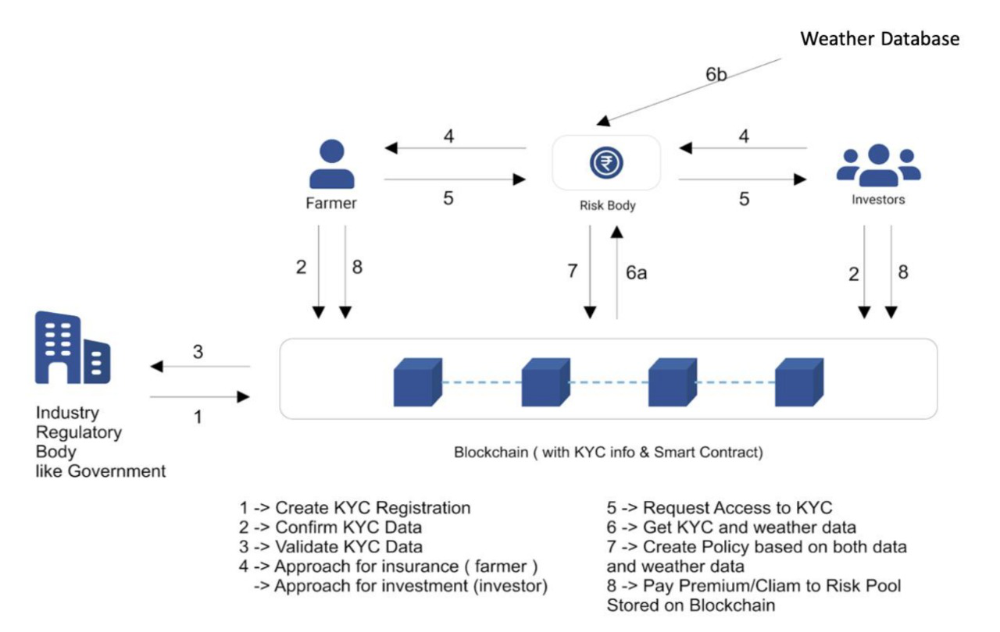
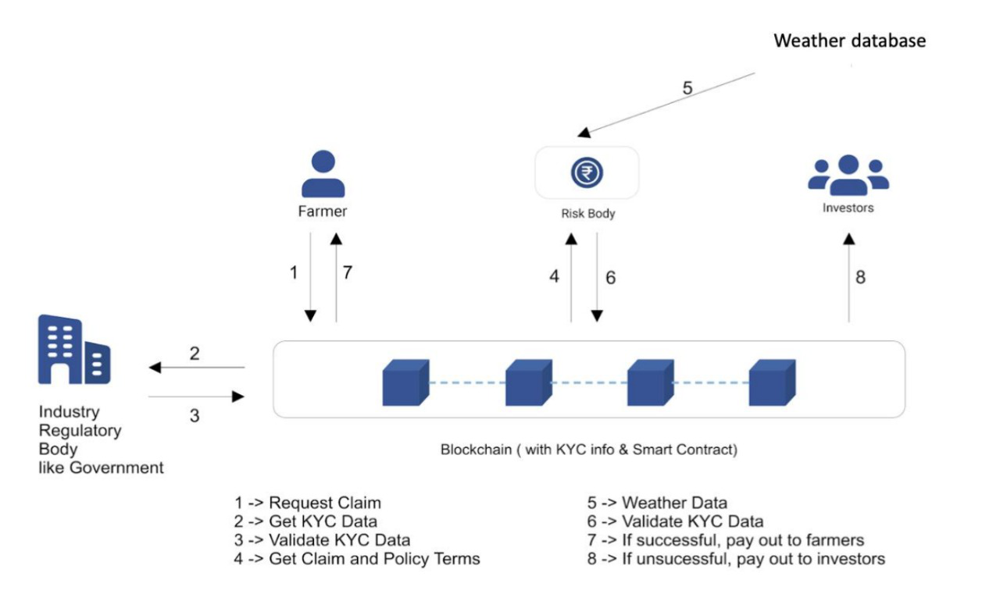
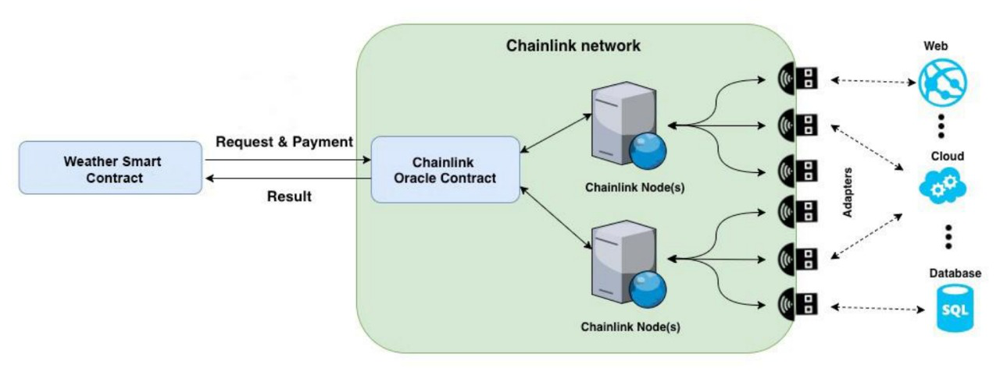

# About Assurance

Agriculture is the lifeline of many economies which contribute highly towards the country's GDP, employment and sustains the population of the country. However, agriculture production comes with various risk factors beyond human control. Farmers are highly exposed to risk and thus the need for financial instruments such as crop insurance comes into play. The claim payout procedure is very lengthy, tedious and there is no proper and adequate provision of security for crops grown by farmers and despite increasing vulnerability, they have not yet fully developed the capacity to mitigate risk effectively.
Thus Assuarance presents a decentralized peer-to-peer crop insurance framework which enables to overcome the current disadvantages by securing farmers’ interests, eliminating intermediaries and providing a secure, standardized, and transparent system that does not hinder any information from stakeholders.

## Objectives

The prime objective of Assuarance is to resolve the shortcomings present in the current scenario. Addressing the shortcomings, the following are our objectives:
Secure the farmers’ interest by enabling different options to invest by crowdsourcing
Provide an efficient system for insurance by eliminating intermediaries
Provide a secure, standardized, and transparent system that does not hinder any information from stakeholders

## Tech Stack

Smart Contract is written in `Solidity`

The front-end and User Interface (UI) of the system is coded using the `React` Web Framework

`Coinbase Wallet`: This is a secure online platform for managing cryptocurrency assets. It is used to hold and transfer funds related to the crop insurance contracts.

`Coinbase Node`: This is a full node implementation of the Dapp. It is used to validate and propagate transactions related to the crop insurance contracts.

`Chainlink`: This is a decentralized oracle network that allows smart contracts to access off-chain data. It is used to retrieve real-time crop yield data and other relevant information for the insurance contracts.
 
The development environment used is `Truffle` Suite

`Ganache` is used to develop and deploy the DApp

To manage payments, `Metamask` is used

The testnet used to deploy the system is `Kovan`, and `Remix` was used for testing the smart contract functionalities. 

##  Platform Architecture and Functionality

The architecture of Assuarance is divided into two parts:
Creating the policy 
Figure 1 represents the creation of policy for crop insurance.The farmer in the diagram represents one node of the network who wants to create a policy, whereas the investor represents the other node on the network who wants to cover for the policy. Firstly, a regulatory body conducts a Know Your Customer (KYC) verification of all the participating parties that are farmers and investors. The KYC details are stored on the blockchain and are available for everyone. Now the farmer goes to the website and creates their own policies. The premium and cover values are calculated by an external risk body who submits its report to the system. Once the farmer enters the details and pays the premium, a policy is created. The investor can then cover this policy by paying the coverage amount and thus an investor and farmer goes into the contract. The contract or agreement is stored on the blockchain and along with it, the amount paid is also stored on the chain. Thus, there can be no fraudulent activity. This step is achieved by the use of a smart contract. The contract executes automatically when the condition is met and this property of the contract is used in insurance claims.

Claiming the policy
Once the farmer claims the policy, the smart contract fetches the external weather data using chain link nodes. Depending on the amount of rainfall in that region the trigger is set in the smart contract. If the rainfall is less, then the investor receives their cover back along with the premium paid by the farmer as incentive for covering. If the rainfall is more than the threshold, then the farmer receives their cover along with the premium he had paid as coverage for the damages.
The claim processing part is quick and without any delay as it is just a code and so the necessary body receives the claim immediately and does not have to wait for months to get it. With the help of private investors, self reliance is promoted which is the need of the hour at the moment.

Interaction of blockchain with external environment via Chainlink

## Roadmap

Smart contract optimization: Improve code re-usage and remove redundant checks to decrease smart contract size, thus lower the opt-in costs
We will focus on the core functionality of selling and buying on our app and integrate a limited amount of policies. New ones will be added gradually as we can digest more data from sales and traits and add it to our price prediction model
Will focus on integrating other insurance policies and keep adding functionalities on all chains

